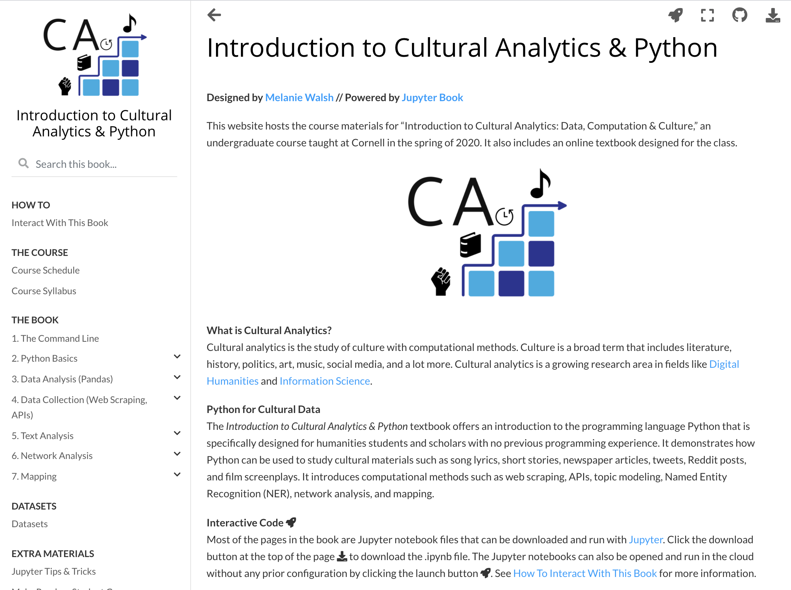
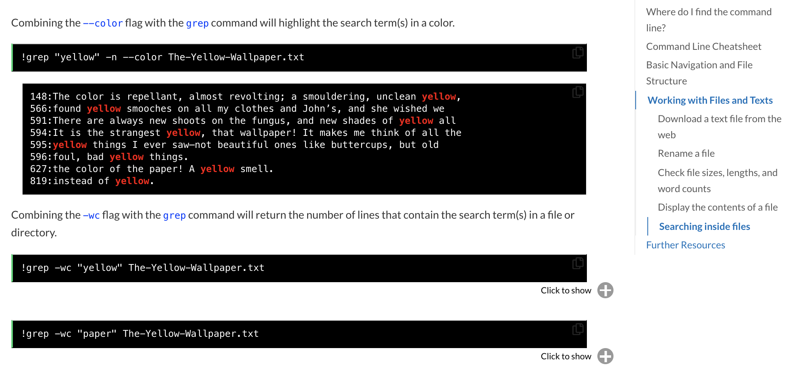
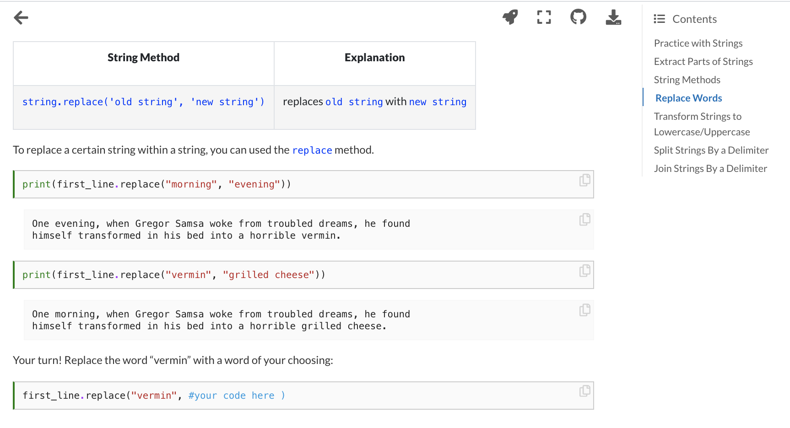
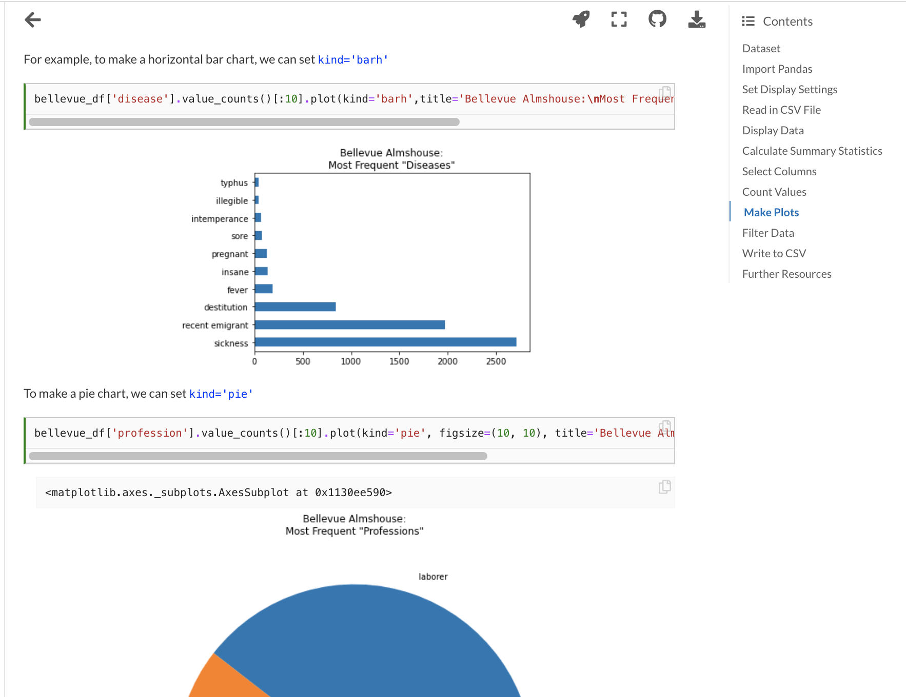
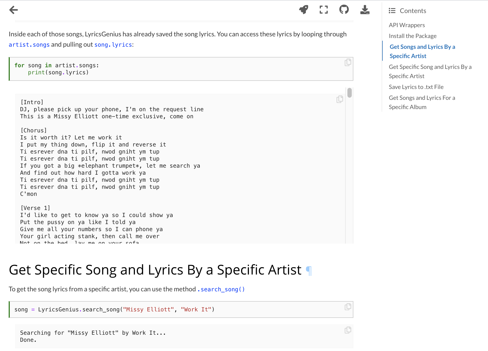
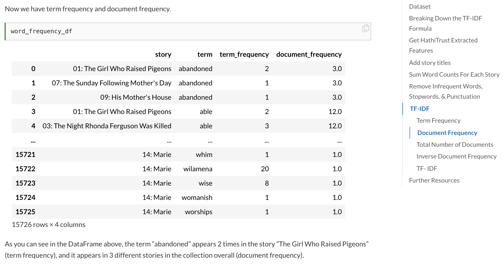
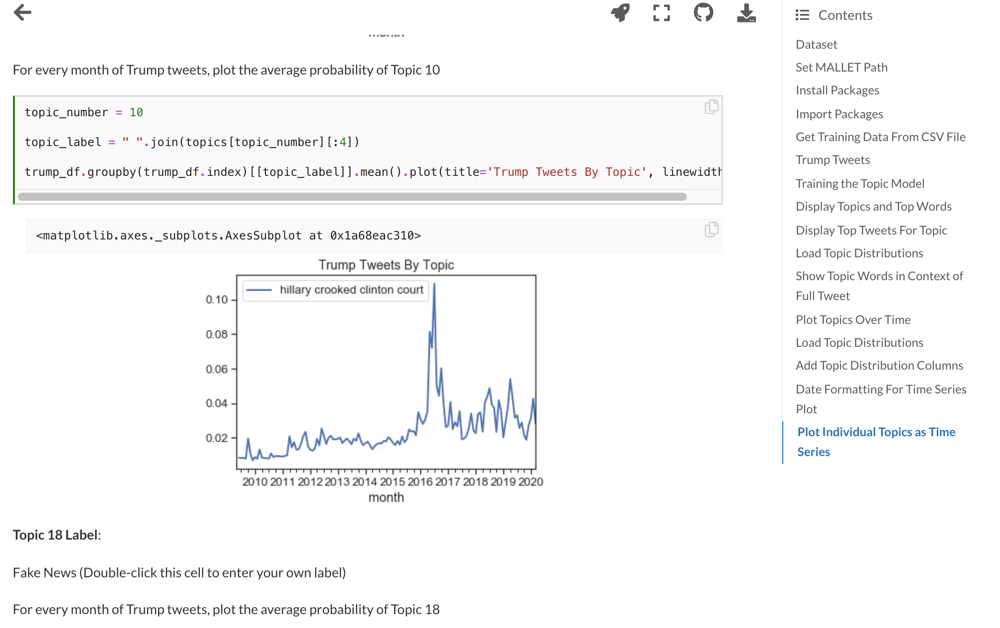
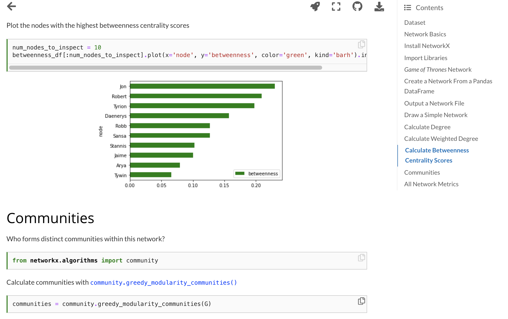
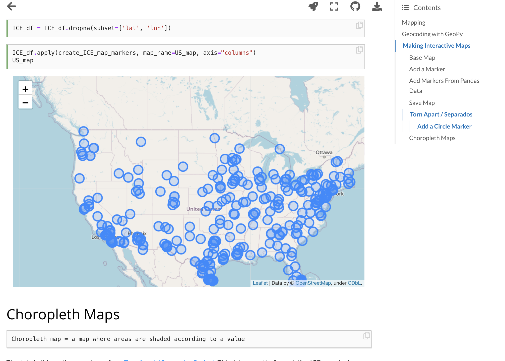

In this blog post, I will give a brief overview of my work-in-progress textbook, [*Introduction to Cultural Analytics & Python*,](https://melaniewalsh.github.io/Intro-Cultural-Analytics/) which I made with a stellar new project called [Jupyter Book](https://jupyterbook.org/intro.html). Thanks to Jupyter Book, the textbook includes interactive code, responsive data visualizations, downloadable Jupyter notebooks, and a lot of other neat features.

**What is a Jupyter notebook?**  
[Jupyter notebooks](https://jupyter-notebook-beginner-guide.readthedocs.io/en/latest/what_is_jupyter.html#notebook-document) are special documents that can combine runnable programming code with regular text, images, links, and a lot more. Jupyter notebooks are very useful for exploring, teaching, and learning code.
{: .notice--purple}

I developed this textbook for an undergraduate course that I'm teaching at Cornell, ["Introduction to Cultural Analytics: Data, Computation, & Culture,"](https://classes.cornell.edu/browse/roster/SP21/class/INFO/1350) which introduces Python programming to students who are interested in the humanities and social sciences. Most of the students have no previous background or training in programming.

Throughout the semester, we text mine [short stories](https://melaniewalsh.github.io/Intro-Cultural-Analytics/Text-Analysis/TF-IDF-HathiTrust.html), [songs](https://melaniewalsh.github.io/Intro-Cultural-Analytics/Data-Collection/Song-Lyrics-Analysis.html#word-count-data-viz-with-pandas), and [tweets](https://melaniewalsh.github.io/Intro-Cultural-Analytics/Data-Collection/Twitter-Data-Analysis.html#display-links-and-images-in-twitter-data). We analyze character networks from [*Game of Thrones*](https://melaniewalsh.github.io/Intro-Cultural-Analytics/Network-Analysis/Network-Analysis.html#calculate-degree) and study [dialogue from Hollywood films](https://melaniewalsh.github.io/Intro-Cultural-Analytics/Data-Analysis/Pandas-Basics-Part3.html). We also reflect about the complexities of reducing human life to data and try to develop methodologies geared toward justice. We engage with historical data about [Irish immigrants](https://melaniewalsh.github.io/Intro-Cultural-Analytics/Data-Analysis/Pandas-Basics-Part1.html) and [enslaved people from the Trans-Atlantic Slave Trade](https://melaniewalsh.github.io/Intro-Cultural-Analytics/Data-Analysis/Pandas-Basics-Part2.html), as well as scholars' prior data-driven work in these areas. We discuss [ ethical challenges](https://melaniewalsh.github.io/Intro-Cultural-Analytics/Data-Collection/User-Ethics-Legal-Concerns.html) related to social media data collection, and we explore the [data](https://melaniewalsh.github.io/Intro-Cultural-Analytics/Mapping/Mapping.html#torn-apart-separados) behind projects like [Torn Apart/Separados](http://xpmethod.columbia.edu/torn-apart/volume/1/), which maps the locations of Immigration and Customs Enforcement (ICE) detention facilities. 

I'm including a quick outline of the material you can find in my textbook below. After this outline, I discuss why I used Jupyter Book to make the textbook, and why I think Jupyter Book is a game-changer for publications and educational resources that involve code. In short, you can publish a collection of Jupyter notebooks as a good-looking, easily navigable online book, where users can hide and reveal content, explore interactive data visualizations, open and run code in the cloud via Binder or Google CoLab, and a lot more.

# *Introduction to Cultural Analytics & Python*

Here's a snapshot of some of the material and lessons you can find in [*Introduction to Cultural Analytics & Python*](https://melaniewalsh.github.io/Intro-Cultural-Analytics/):

* [Course readings and schedule for "Introduction to Cultural Analytics," undergraduate course taught at Cornell University in Spring 2020 and 2021](https://melaniewalsh.github.io/Intro-Cultural-Analytics/course-schedule.html)
* [Datasets related to humanities and culture](https://melaniewalsh.github.io/Intro-Cultural-Analytics/Datasets/Datasets.html)
  
* [Introduction to the command line](https://melaniewalsh.github.io/Intro-Cultural-Analytics/Command-Line/The-Command-Line.html)
  

* Python basics
  * [Variables](https://melaniewalsh.github.io/Intro-Cultural-Analytics/Python/Variables.html)
  * [Data types](https://melaniewalsh.github.io/Intro-Cultural-Analytics/Python/Data-Types.html)
  * [String methods](https://melaniewalsh.github.io/Intro-Cultural-Analytics/Python/String-Methods.html)
  
  * [Comparisons and conditionals](https://melaniewalsh.github.io/Intro-Cultural-Analytics/Python/Comparisons-Conditionals.html)
  * [Lists and loops](https://melaniewalsh.github.io/Intro-Cultural-Analytics/Python/Lists-Loops-Part1.html)
  * [Dictionaries](https://melaniewalsh.github.io/Intro-Cultural-Analytics/Python/Dictionaries.html)
  * [Functions](https://melaniewalsh.github.io/Intro-Cultural-Analytics/Python/Dictionaries.html)

* Data analysis with Pandas
  * [Historical data about Irish immigrants](https://melaniewalsh.github.io/Intro-Cultural-Analytics/Data-Analysis/Pandas-Basics-Part1.html)
  
  * [Historical data about the Trans-Atlantic Slave Trade](https://melaniewalsh.github.io/Intro-Cultural-Analytics/Data-Analysis/Pandas-Basics-Part2.html)
  * [Data about Hollywood movie dialogue](https://melaniewalsh.github.io/Intro-Cultural-Analytics/Data-Analysis/Pandas-Basics-Part3.html)
* Data collection
  * [Best practices for social media data collection](https://melaniewalsh.github.io/Intro-Cultural-Analytics/Data-Collection/User-Ethics-Legal-Concerns.html)
  * [Web scraping Genius.com with BeautifulSoup & LyricsGenius](https://melaniewalsh.github.io/Intro-Cultural-Analytics/Data-Collection/Web-Scraping-Part1.html)
  
  * [Collecting tweets with Twitter API & Twarc](https://melaniewalsh.github.io/Intro-Cultural-Analytics/Data-Collection/Twitter-Data-Collection.html)
  * [Collecting Reddit posts with Pushshift](https://melaniewalsh.github.io/Intro-Cultural-Analytics/Data-Collection/Reddit-Data-Collection-With-PSAW.html)

* Text analysis
  * Term Frequency-Inverse Document Frequency
    * [With in-copyright book data from the HathiTrust Digital Library](https://melaniewalsh.github.io/Intro-Cultural-Analytics/Text-Analysis/TF-IDF-HathiTrust.html)
    
    * [With plain text files](https://melaniewalsh.github.io/Intro-Cultural-Analytics/Text-Analysis/TF-IDF-Scikit-Learn.html)
      
  * Topic Modeling with Little MALLET Wrapper
    * [*New York Times* obituaries](https://melaniewalsh.github.io/Intro-Cultural-Analytics/Text-Analysis/Topic-Modeling-Text-Files.html)
    * [Am I The Asshole? Reddit posts](https://melaniewalsh.github.io/Intro-Cultural-Analytics/Text-Analysis/Topic-Modeling-CSV.html)
    * [Donald Trump tweets](https://melaniewalsh.github.io/Intro-Cultural-Analytics/Text-Analysis/Topic-Modeling-Time-Series.html)
    
  * [Named Entity Recognition with spaCy](https://melaniewalsh.github.io/Intro-Cultural-Analytics/Text-Analysis/Named-Entity-Recognition.html)
  * [Part-of-speech tagging with spaCy](https://melaniewalsh.github.io/Intro-Cultural-Analytics/Text-Analysis/POS-Keywords.html)
* Network analysis
  * [With NetworkX and *Game of Thrones* characters](https://melaniewalsh.github.io/Intro-Cultural-Analytics/Network-Analysis/Network-Analysis.html)
  
  * [Making interactive networks with Bokeh](https://melaniewalsh.github.io/Intro-Cultural-Analytics/Network-Analysis/Making-Network-Viz-with-Bokeh.html)
* Mapping
  * [Geocoding](https://melaniewalsh.github.io/Intro-Cultural-Analytics/Mapping/Mapping.html#geocoding-with-geopy)
  * [Making interactive maps with Folium](https://melaniewalsh.github.io/Intro-Cultural-Analytics/Mapping/Mapping.html#making-interactive-maps)
  
  * [Publishing maps on the web](https://melaniewalsh.github.io/Intro-Cultural-Analytics/Mapping/Publish-Your-Map.html)

* Future content
  * In the future, I plan to add sections on object-oriented programming, virtual environments, git, and VSCode

# Why Jupyter Book? What is Jupyter Book?

My undergraduate class, "Introduction to Cultural Analytics," falls into a research area known as digital humanities or cultural analytics (as the title suggests), which blends digital and computational methods with humanities and culture. This academic field has been growing rapidly over the last 20 years, so luckily I had a lot of great, already existing resources to draw from when developing my class — such as Python-based course materials from [Lauren Klein](https://github.com/laurenfklein/emory-qtm340), [David Mimno](https://mimno.infosci.cornell.edu/info3350/), and [Allison Parrish](https://github.com/aparrish/rwet).

These course materials are awesome for many reasons, but one especially awesome thing is that they include the actual Python code taught in classes. Publishing this code online allows students to reference and return to the material covered in class, but it also allows people who are not enrolled in the class — instructors, students, or people who are just plain interested — to learn and follow along, too. There's a big appetite for learning these computational skills, especially among people from humanities disciplines who have minimal or non-traditional programming education and experience. So these materials are an important resource for the whole community.

Most of this code is published as Jupyter notebooks — special documents that can combine runnable programming code with regular text, images, links, and a lot more. Jupyter notebooks are very useful for exploring, teaching, and learning code.



I *love* Jupyter notebooks. I use them all the time. But I also recognize that Jupyter notebooks can be challenging to work with and can seem confusing if you're not familiar with them. For example, you can't open a Jupyter notebook — or run its code — unless you have the right software installed *and* running on your own computer.



Recognizing this problem, GitHub, a popular repository for hosting code, allows you to preview static versions of Jupyter notebooks on the web, even if you don't have the right software installed and running. This is an awesome feature!

But these GitHub previews are often slow to load, and they don't always look exactly the way you want. What's more, if you're not familiar with it, GitHub can be pretty confusing, too. I found GitHub to be a very non-intuitive and intimidating platform to navigate at first.





This is all to say that publishing code-based course materials on GitHub is mostly great, especially if you introduce your students to GitHub or they're already familiar with it.

But for my course materials, I hoped to have a little more control over aesthetics, navigation, and display, and I hoped to reach an audience of people who might not be familiar with GitHub yet. So I started researching alternatives. That's when I found the incredible, newly launched [Jupyter Book project](https://jupyterbook.org/intro.html). The Jupyter Book resource can transform a collection of Jupyter notebooks into nicely readable, aesthetically pleasing HTML files and publish them as an easily navigable online book. All you need is the command-line tool and a directory of Jupyter notebooks organized in the right way with a special configuration file and table of contents.



But making pretty web pages is not all Jupyter Book can do. When you're reading through a page in an online Jupyter Book, you can also download a PDF of that page or the actual Jupyter notebook file behind the page, which means that you can open it and run the code on your own computer. You can also open up that same Jupyter notebook in the cloud — via Binder or Google CoLab — and play with the code without configuring any software or dependencies. Can you tell that I find all this exciting?



I found the Jupyter Book project so exciting that I decided to bundle up my course materials and publish them as a Jupyter Book.

The textbook is still being updated and revised, but so far it's proved to be a useful resource for my students. Because I published all the Jupyter notebooks that we covered in class, my students could easily reference and review materials after class, but they could also use it during class. If some software package wasn't working on a particular student's computer — an occurrence that seems frankly unavoidable even with the best preparation and troubleshooting from instructors and TAs — they could just open up the Jupyter notebook for that day's class in the cloud via Binder and work through the code remotely. This gave us a chance to resolve specific technical issues later and helped keep students from falling behind during class.

Beyond its interactive code capabilities, Jupyter Book has loads of other cool features. You can create [attention-grabbing content blocks](https://jupyterbook.org/content/content-blocks.html) for notes, warnings, and tips — or for anything else you want. They're customizable!

  
    
  
 
 You can [hide code cells](https://jupyterbook.org/interactive/hiding.html) and allow users to reveal them.

  

You can [enable scrolling](https://jupyterbook.org/content/code-outputs.html?highlight=output%20scroll#scrolling-cell-outputs) for really long outputs. 

  

You can even publish [interactive data visualizations](https://jupyterbook.org/interactive/interactive.html).

   
  
   

There are tons of other awesome Jupyter Book features not covered here, and many more still being developed. The Jupyter Book community is super active and responsive. They regularly roll out new versions and [eagerly engage with users](https://github.com/executablebooks/jupyter-book/issues). Over the last year, Jupyter Book developers like Chris Holdgraf and Chris Sewell have patiently helped me troubleshoot issues, listened to my suggestions, and even helped promote my textbook! It's been a genuine pleasure to interact with them and the rest of the community.

I'm very excited about the future of Jupyter Book, and I think that digital humanities/cultural analytics scholars can really benefit from and contribute to it.

# Want to Build Your Own Jupyter Book?

You can find all the code for *Introduction to Cultural Analytics & Python* [in this GitHub repository](https://github.com/melaniewalsh/Intro-Cultural-Analytics). In the README, I briefly explain the structure of the repository and what's required to generate a Jupyter Book. You can also learn more by reading the Jupyter Book [documentation](https://jupyterbook.org/intro.html) and by exploring [the Jupyter Books and repositories in the featured gallery](https://executablebooks.org/en/latest/gallery.html).

# Feedback?

If you have feedback or suggestions about *Introduction to Cultural Analytics & Python*, or you happen to find it useful, please let me know! I'd love to hear from you via email, [Twitter](https://twitter.com/mellymeldubs), or [GitHub](https://github.com/melaniewalsh/Intro-Cultural-Analytics/issues).
