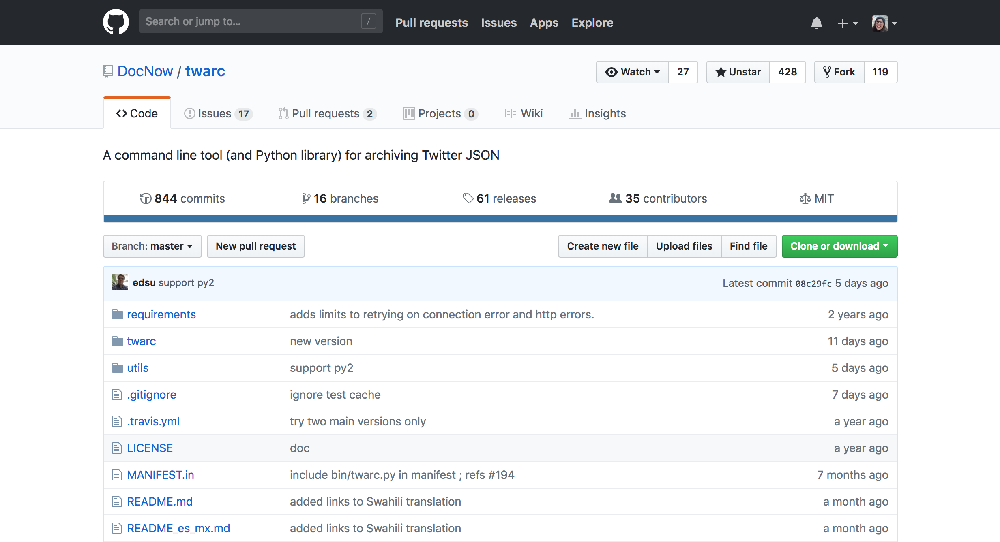
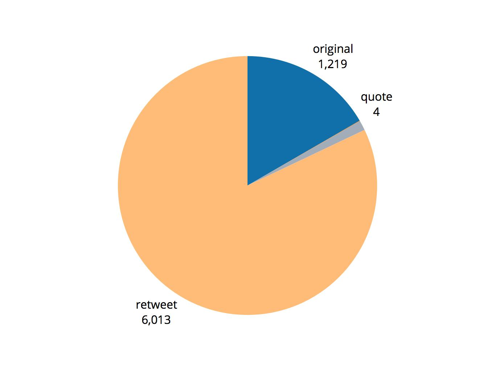
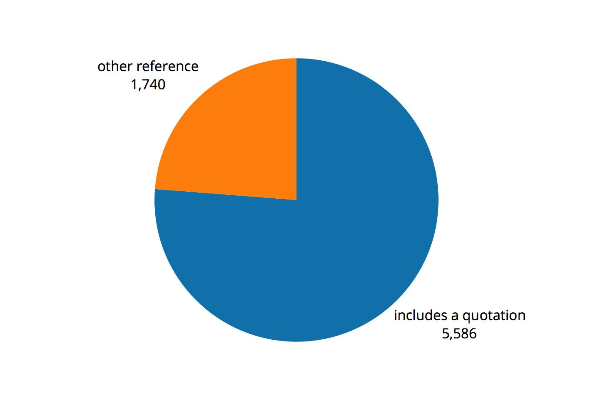
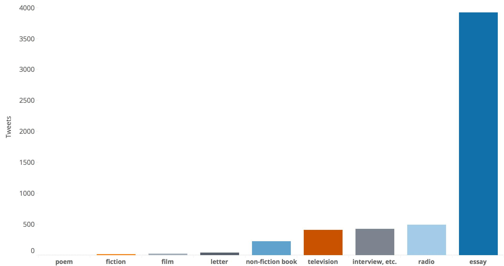
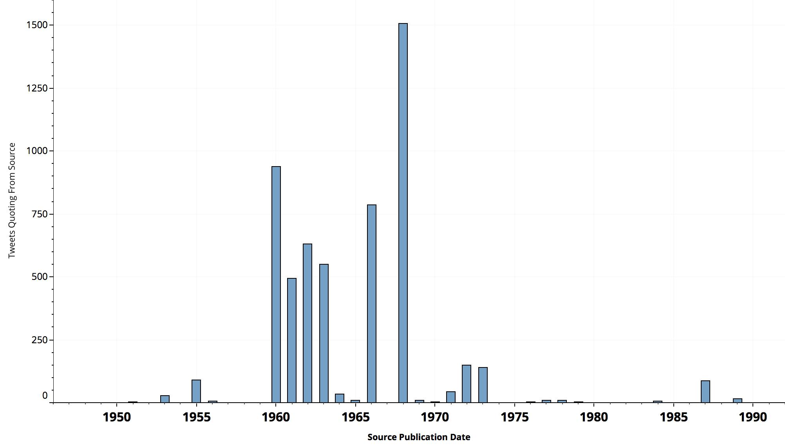

 <section data-menu-title="Title:  James Baldwin, #BlackLivesMatter, and Networks of Textual Recirculation"></section>
 <br>
 <br>
 <br>
 <span style="font-size:1.3em">James Baldwin, #BlackLivesMatter,
<br>and Networks of Textual Recirculation </span>
<br>
<br>
 <small>by [Melanie Walsh](http://melaniewalsh.org/) / [@mellymeldubs](https://twitter.com/mellymeldubs) </small>
<br>
<br>
<small style="text-align:center; float:none;bottom:0px;font-size:.5em;margin-top:100px;">To navigate this slideshow, press the <i class="em em-arrow_right"></i> and <i class="em em-arrow_down"></i> arrows, or click the <i class="em em-hamburger"></i> menu in the bottom left corner.
<br>
<br>
To access a version of this slideshow that has been translated into Spanish, see [link]().
</small>

---

 <section data-menu-title="The Negro in American Culture (with video)"></section>
"The Negro in American Culture"

WBAI-FM | January 1961

<iframe width="560" height="315" src="https://www.youtube.com/embed/jNpitdJSXWY?rel=0&amp;disablekb=1&amp;start=43;end=65" frameborder="0" allow="autoplay; encrypted-media" allowfullscreen></iframe>

<small>"To be a Negro in this country and to be relatively conscious,
<br> is to be in a state of rage almost all the time."</small>

<small style="font-size:.3em;margin-top:50px;">After playing the video, click away to advance <i class="em em-three_button_mouse"></i></small>

---

<section data-menu-title="#BlackLivesMatter Tweet"></section>

<br>

<small>"To be a <span style="color:  rgb(3, 28, 255)">Negro in this country </span> and to be <span style="color:  rgb(3, 28, 255)">relatively</span> conscious,
<br> is to be in a <span style="color:  rgb(3, 28, 255)">state of rage almost all the time</span>."</small>

<br>

<blockquote class="twitter-tweet" data-lang="en" align="center" width="550px" height="500px"><p lang="en" dir="ltr"><a href="https://twitter.com/hashtag/MikeBrown?src=hash&amp;ref_src=twsrc%5Etfw">#MikeBrown</a> &amp; <a href="https://twitter.com/hashtag/EricGarner?src=hash&amp;ref_src=twsrc%5Etfw">#EricGarner</a>&#39;s death speak to James Baldwin&#39;s quote; &quot;to be black a conscious in America is to be in a constant state of rage&quot;</p>&mdash; Kim Moore (@SoulRevision) <a href="https://twitter.com/SoulRevision/status/498298410299318273?ref_src=twsrc%5Etfw">August 10, 2014</a></blockquote>
<script async src="https://platform.twitter.com/widgets.js" charset="utf-8"></script>

<br>
<small>"To be <span style="color:  rgb(255, 11, 11)">black </span> a[nd] conscious in America is to be in a <span style="color:  rgb(255, 11, 11)"> constant state of </span> rage" </small>

---

### Basic Outline

* [Data & Methods](#/5)

* [#BlackLivesMatter-Baldwin Findings](#/6)

* [Looking Forward: Social Media Data, Readership/Reception, Networks of Textual Recirculation](#/7)

---

### Data and Methods


--

<span style="display:none;"> Beyond the hashtags </span>

<small>["Beyond the hashtags: #Ferguson, #Blacklivesmatter, and the online struggle for offline justice"](http://cmsimpact.org/resource/beyond-hashtags-ferguson-blacklivesmatter-online-struggle-offline-justice/)
<br>
by Deen Freelon, Charlton D. McIlwain, and Meredith D. Clark </small>

<iframe style="height:400px;width:500px;align:left;" src="http://cmsimpact.org/wp-content/uploads/2016/03/beyond_the_hashtags_2016.pdf"></iframe>


<small>["40,815,975 tweets matching...45 keywords that were posted between **June 1, 2014 and May 31, 2015** and had not been deleted or protected as of July 2015"](http://dfreelon.org/2017/01/03/beyond-the-hashtags-twitter-data/)</small>


--

<span style="display:none;"> twarc </span>

 [twarc](https://github.com/DocNow/twarc)

```
twarc hydrate bth_ids.txt > bth_tweets.jsonl
```

<a href="https://github.com/DocNow/twarc"></a>


<small style="font-size:.3em;margin-top:50px;">Documentation translated into [Portuguese](https://github.com/DocNow/twarc/blob/master/README_pt_br.md), [Spanish](https://github.com/DocNow/twarc/blob/master/README_es_mx.md), [Swahili](https://github.com/DocNow/twarc/blob/master/README_sw_ke.md), and [Swedish](https://github.com/DocNow/twarc/blob/master/README_sv_se.md)</small>


--

<span style="display:none;">Documenting the Now</span>

[Documenting the Now](https://www.docnow.io/)

<br>

<iframe style="height:400px;width:500px;align:left;" src="https://www.docnow.io/"></iframe>


--

<span style="display:none;"> jq </span>

[jq](https://stedolan.github.io/jq/)

```
jq -c "select(.text | test(\"James ?Baldwin\";\"i\"))" bth_tweets.jsonl > bth_jamesbaldwin.jsonl
```

<iframe style="height:400px;width:500px;align:left;" src="https://stedolan.github.io/jq/"></iframe>


---

### #BlackLivesMatter-Baldwin Findings


--

<span style="display:none;"> What kind of tweets? </span>

What kind of tweets?




--

<span style="display:none;"> How was Baldwin invoked? </span>

How was Baldwin invoked?




--

<span style="display:none;"> Which kinds of texts were quoted from? </span>

Which kinds of texts were quoted from...?




--

<span style="display:none;"> ...and from what part of Baldwin's career? </span>

...and from which parts of Baldwin's career?




--
